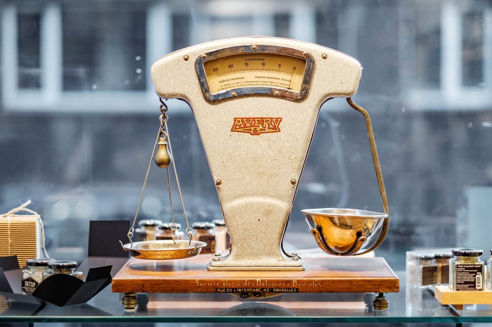
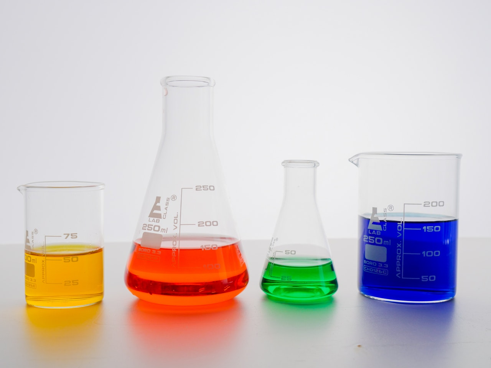
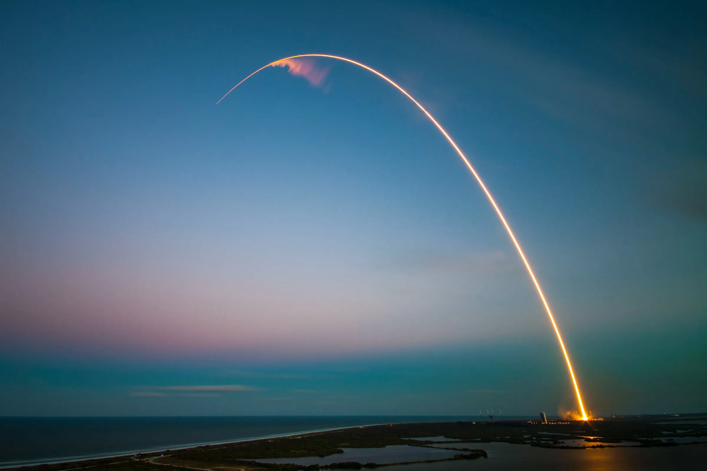
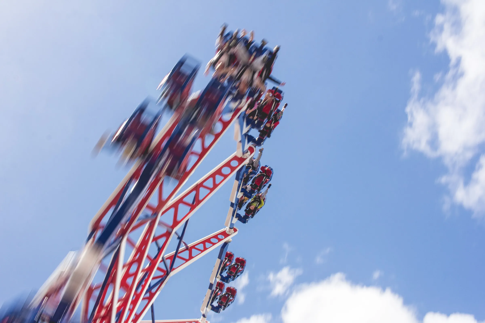
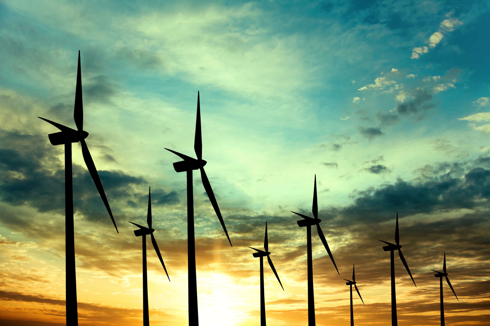

---
hide:
  - toc
---

# 📕 1.º Bach

-   [{ width="100%" }](leyes-fundamentales-quimica/index.md)

    **Leyes fundamentales de la Química**

    Leyes ponderales y leyes de los gases ideales

    [🧑‍🏫 Diapositivas](leyes-fundamentales-quimica/diapositivas) · [📜 Póster](leyes-fundamentales-quimica/leyes-fundamentales-quimica-poster.pdf) · [🔗 Ejercicios](https://drive.google.com/file/d/13uu0I91bKV4gfYCmoWBh3wSgCLKbOdNl/view) · [📝 Frikiexámenes](leyes-fundamentales-quimica/leyes-fundamentales-quimica-frikiexamenes.pdf)

-   [{ width="100%" }](disoluciones/index.md)

    **Disoluciones**

    Concentración, solubilidad, preparación y propiedades coligativas

    [🧑‍🏫 Diapositivas](disoluciones/diapositivas) · [📜 Póster](disoluciones/disoluciones-poster.pdf)

-   [{ width="100%" }](reacciones-quimicas/index.md)

    **Reacciones químicas**

    Clasificación y estequiometría de las reacciones químicas

    [🧑‍🏫 Diapositivas](reacciones-quimicas/diapositivas) · [📜 Póster](reacciones-quimicas/reacciones-quimicas-poster.pdf)

-   [{ width="100%" }](cinematica-vectorial/index.md)

    **Cinemática vectorial**

    Magnitudes cinemáticas y movimientos rectilíneos

    [🧑‍🏫 Diapositivas](cinematica-vectorial/diapositivas) · [📜 Póster](cinematica-vectorial/cinematica-vectorial-poster.pdf)

-   [{ width="100%" }](movimiento-parabolico/index.md)

    **Movimiento parabólico**

    Estudio del tiro parabólico u oblicuo

    [🧑‍🏫 Diapositivas](movimiento-parabolico/diapositivas) · [📜 Póster](movimiento-parabolico/movimiento-parabolico-poster.pdf)

-   [{ width="100%" }](movimiento-circular/index.md)

    **Movimiento circular**

    Cinemática y dinámica del movimiento circular

    [🧑‍🏫 Diapositivas](movimiento-circular/diapositivas) · [📜 Póster](movimiento-circular/movimiento-circular-poster.pdf)

-   [{ width="100%" }](estatica-dinamica/index.md)

    **Estática y dinámica**

    Estática y dinámica de una partícula y un sólido rígido

    [🧑‍🏫 Diapositivas](estatica-dinamica/diapositivas) · [📜 Póster](estatica-dinamica/estatica-dinamica-poster.pdf)

-   [{ width="100%" }](energia-trabajo/index.md)

    **Energía y trabajo**

    Trabajo. Potencia. Energía. Teorema de las fuerzas vivas. Sistemas conservativos

    [🧑‍🏫 Diapositivas](energia-trabajo/diapositivas) · [📜 Póster](energia-trabajo/energia-trabajo-poster.pdf)

-   [{ width="100%" }](termodinamica/index.md)

    **Termodinámica**

    Variables termodinámicas de un sistema en función de las condiciones

    [🧑‍🏫 Diapositivas](termodinamica/diapositivas) · [📜 Póster](termodinamica/termodinamica-poster.pdf)

