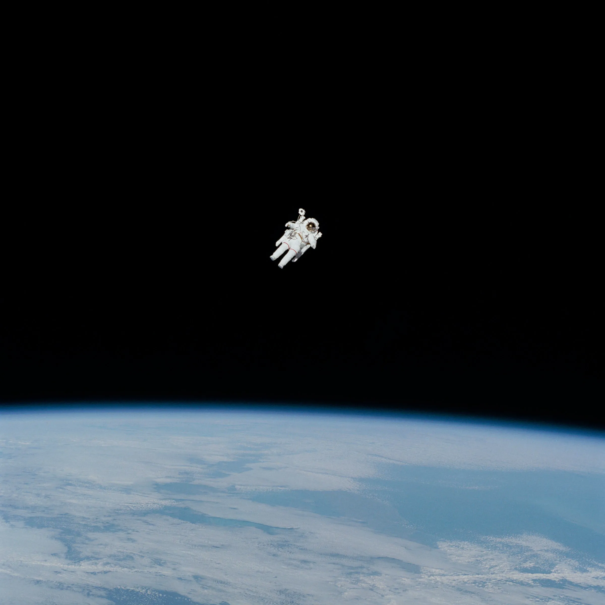
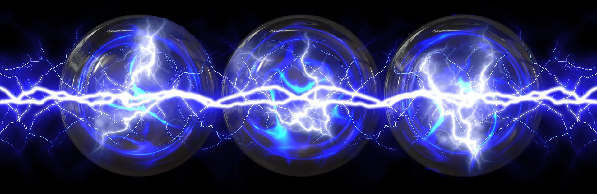
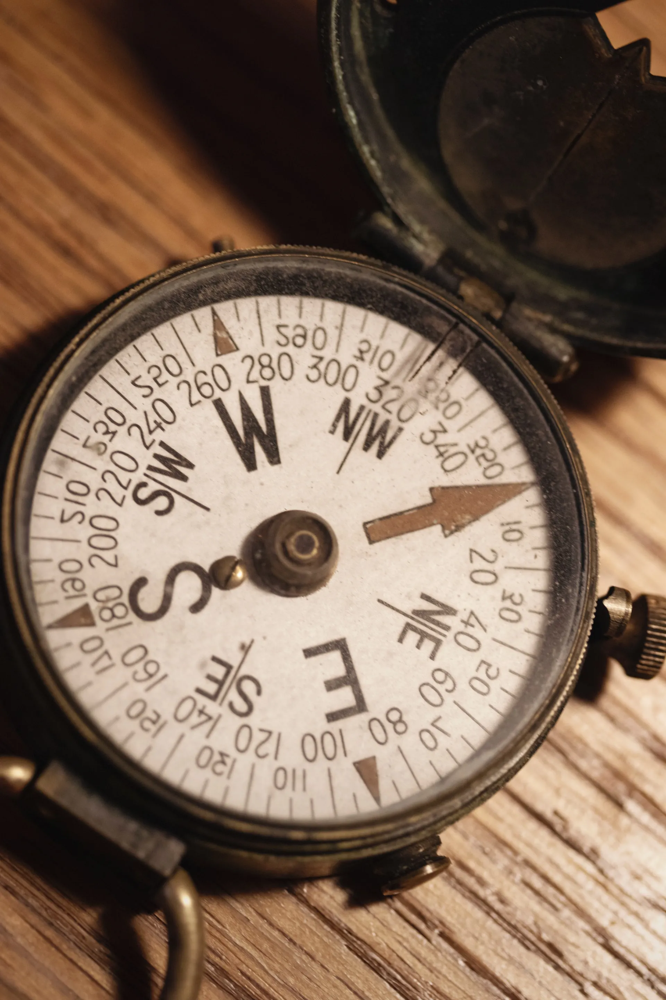
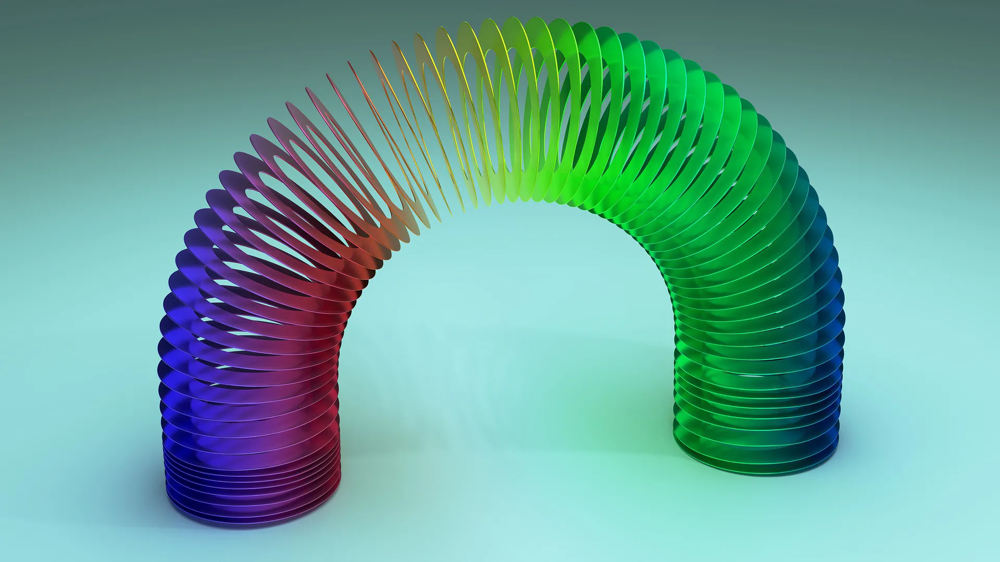
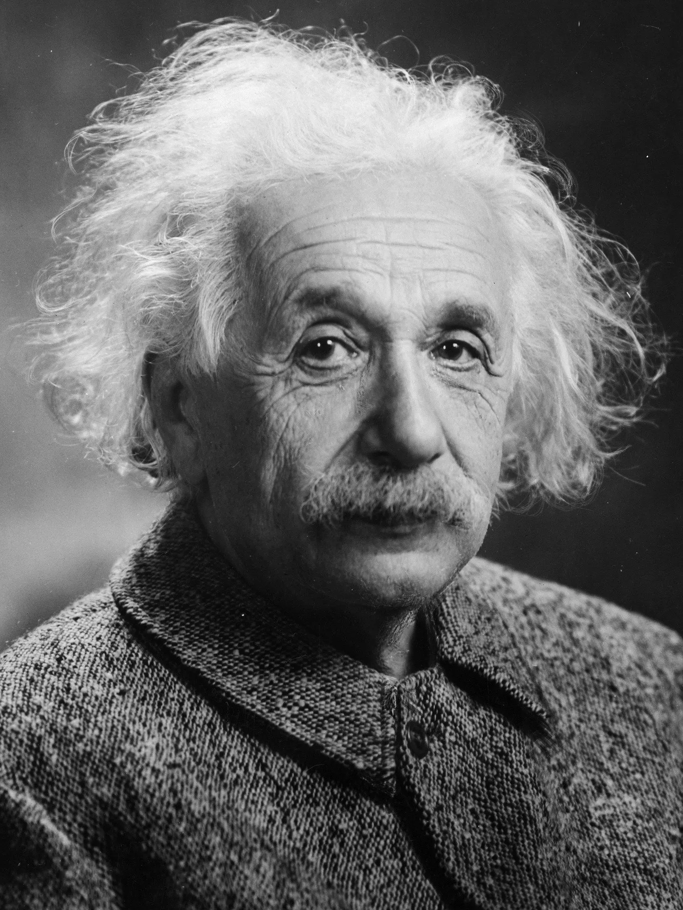

---
hide:
  - toc
---

# 🧲 Física

!!! note ""
    También te recomendamos echar un vistazo a las excelentes [**guías** de **Berto Tomás**](https://www.aprendiendofisicaconbertotomas.com/gu%C3%ADas) o a las [***chuletillas*** 🥩 de **Curro**](https://drive.google.com/drive/folders/1OXSG4JKxRwPvIL4U-4N1LtcOyt4LIMmQ).

-   [{ width="100%" }](interaccion-gravitatoria/index.md)

    **Interacción gravitatoria**

    Leyes de Kepler. Ley de Gravitación Universal. Campo gravitatorio

-   [{ width="100%" }](campo-electrico/index.md)

    **Campo eléctrico**

    Ley de Coulomb. Energía potencial y potencial eléctrico. Flujo eléctrico

-   [{ width="100%" }](campo-magnetico/index.md)

    **Campo magnético**

    Campo magnético. Flujo magnético. Inducción electromagnética

-   [{ width="100%" }](MAS/index.md)

    **MAS**

    Cinemática, dinámica y energía del movimiento armónico simple

-   [{ width="100%" }](ondas/index.md)

    **Ondas**

    Propagación de ondas transversales y longitudinales. Ecuación de las ondas armónicas. Energía e intensidad. Sonido y luz

-   [{ width="100%" }](optica/index.md)

    **Óptica**

    Leyes de la óptica geométrica. Sistemas ópticos. El ojo humano. Instrumentos ópticos

-   [{ width="100%" }](fisica-s-XX/index.md)

    **Física del s. XX**

    Relatividad. Física Cuántica. Física Nuclear. Radiactividad

