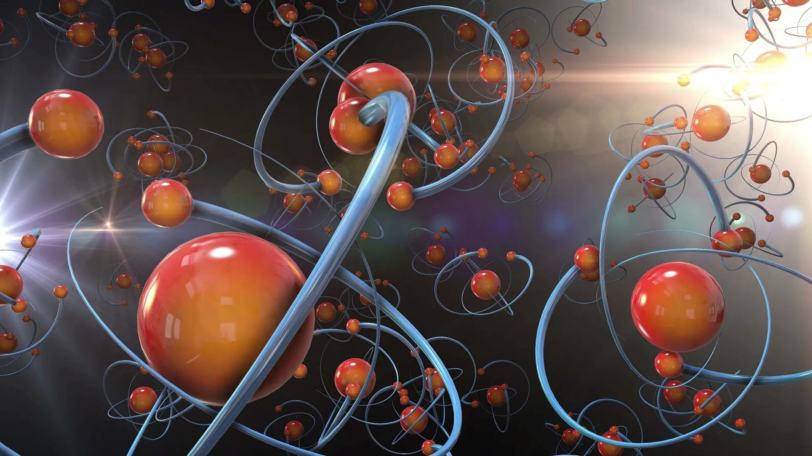
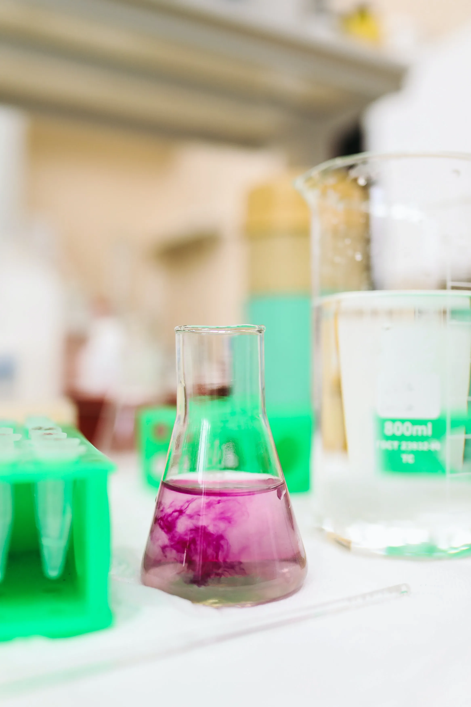
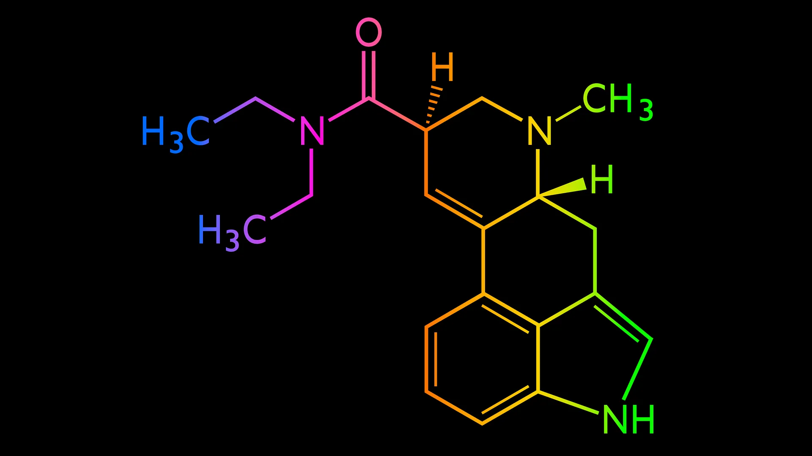

---
hide:
  - toc
---

# ⚗️ Química

!!! note ""
    **Repasa** los contenidos de **Química** de **1.º Bach** con estos [**ejercicios**](repaso-quimica-1Bach-ejercicios.pdf), cortesía de **Alba López Valenzuela**, o estos [**frikiexámenes**](repaso-quimica-1Bach-frikiexamenes.pdf), cortesía de **Leticia Cabezas**.

-   [{ width="100%" }](estructura-materia/index.md)

    **Estructura de la materia**

    Mecánica cuántica, orbitales atómicos, estructura electrónica y partículas subatómicas

-   [{ width="100%" }](sistema-periodico/index.md)

    **Sistema periódico**

    Tabla periódica y configuración electrónica. Propiedades periódicas

-   [{ width="100%" }](enlace-quimico/index.md)

    **Enlace químico**

    Enlace iónico, covalente y metálico. Geometría molecular. Fuerzas intermoleculares

-   [{ width="100%" }](termoquimica/index.md)

    **Termoquímica**

    Transformaciones energéticas y espontaneidad de las reacciones químicas

-   [{ width="100%" }](cinetica-quimica/index.md)

    **Cinética química**

    Velocidad de reacción. Ecuaciones cinéticas. Orden de reacción. Mecanismos de reacción

-   [{ width="100%" }](equilibrio-quimico/index.md)

    **Equilibrio químico**

    Ley de acción de masas. Constante de equilibrio. Principio de Le Chatelier. Equilibrios heterogéneos

-   [{ width="100%" }](acido-base/index.md)

    **Ácido-base**

    Teorías ácido-base. Fuerza relativa de los ácidos y bases. Equilibrio iónico del agua. Concepto de pH. Volumetrías de neutralización ácido-base. Indicadores ácido-base. Hidrólisis de sales. Disoluciones reguladoras. Ácidos y bases relevantes

-   [{ width="100%" }](redox/index.md)

    **Rédox**

    Equilibrio rédox. Ajuste rédox. Pilas galvánicas. Electrolisis

-   [{ width="100%" }](quimica-organica/index.md)

    **Química orgánica**

    Isomería, reactividad y polímeros

