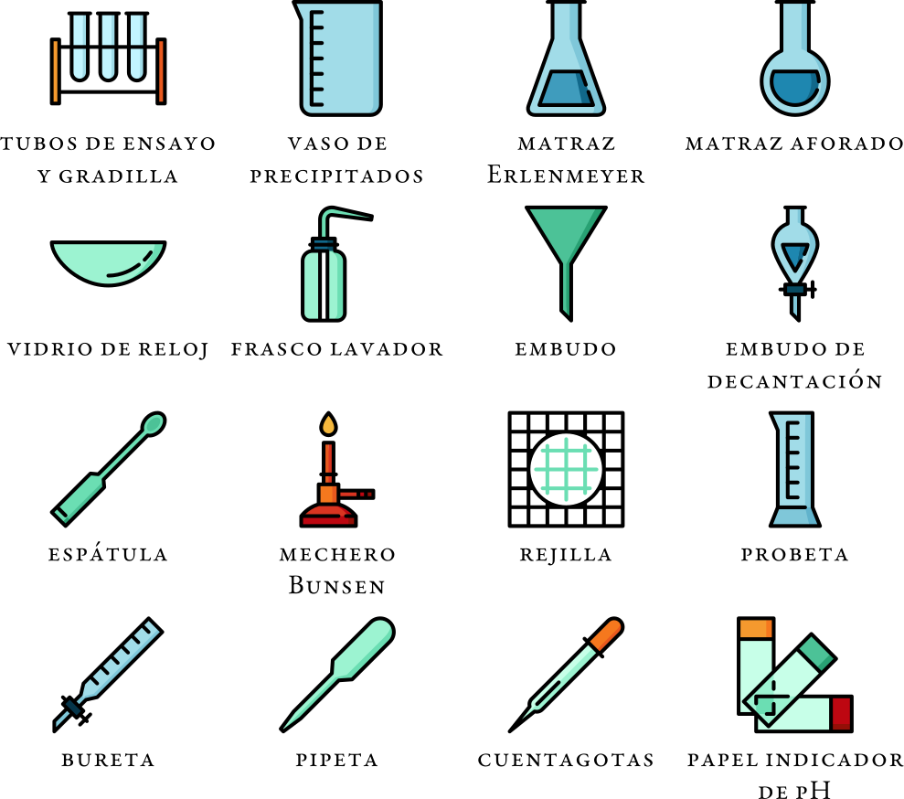
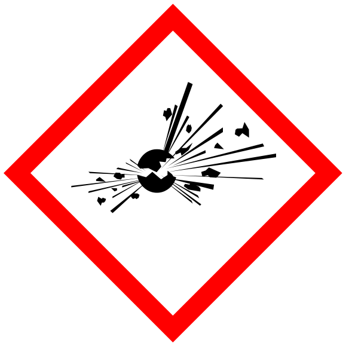
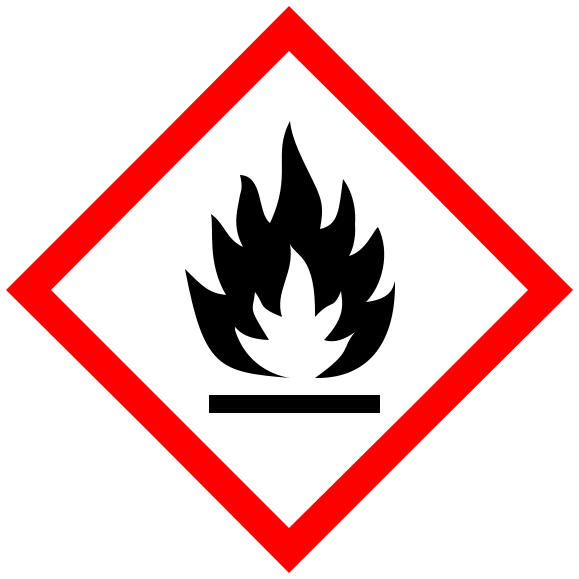
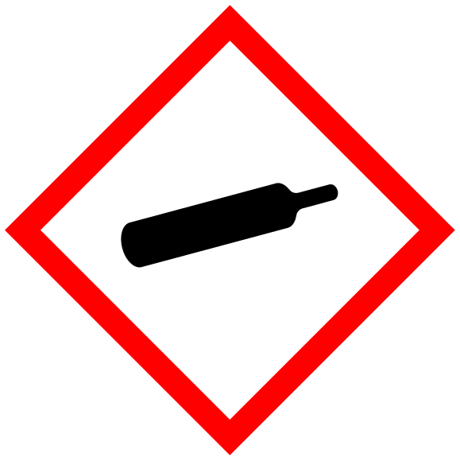
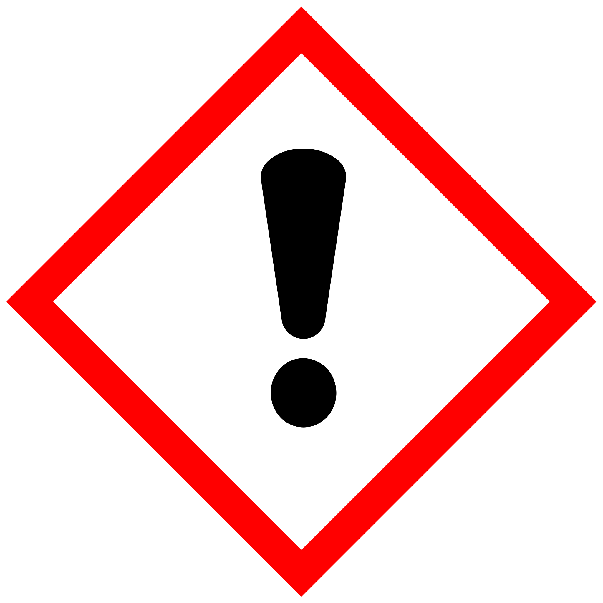

---
tags:
- 🧲 Física
- ⚗️ Química
---

# La actividad científica

<figure markdown="span">
    { width="100%" }
    <figcaption>Foto de [**Hans Reniers**](https://unsplash.com/@hansreniers) en [Unsplash](https://unsplash.com)</figcaption>
</figure>

## Método científico

Las **etapas** del **método científico** son las siguientes:

### Observación
Examinar un fenómeno con el objetivo de sacar toda la información, pero sin modificar dicho fenómeno.

### Hipótesis
Posible explicación del fenómeno.

#### Características
Características que debe cumplir:

- Referirse siempre a situaciones reales o realizables.
- Utilizar un lenguaje claro.
- Variables a tratar precisas y bien definidas, además de ser observables y medibles.

### Experimentación
Comprobación de la hipótesis, tratando de controlar todos los parámetros ajenos al fenómeno que estamos estudiando.

### Análisis
Estudio de los resultados obtenidos.

### Conclusión
Razonamos si la hipótesis es o no válida.

!!! note "Pon en práctica el método científico"
    Puedes poner en práctica el **método científico** estudiando los **factores** que **influyen** en el **periodo** de un **péndulo** con este ***laboratorio***:

    <iframe src="https://phet.colorado.edu/sims/html/pendulum-lab/latest/pendulum-lab_es.html" width="100%" height="600" scrolling="no" allowfullscreen></iframe>

    o con estas excelentes **prácticas virtuales** del [Departamento de Física y Química del IES Valle del Saja](http://www.fqsaja.com):

    

    <iframe width="100%" height="100%" src="https://www.youtube-nocookie.com/embed/2GDKNIyOCSc?si=ZP7AorFThPcJVqiV" title="YouTube video player" frameborder="0" allow="accelerometer; autoplay; clipboard-write; encrypted-media; gyroscope; picture-in-picture; web-share" referrerpolicy="strict-origin-when-cross-origin" allowfullscreen></iframe>
    

    [Aquí](https://drive.google.com/file/d/1owiVZCn_q65ysah9wkTMEPT7nKGVclwe/view) puedes descargarte el **guion** de la **práctica**.

    

    <iframe width="100%" height="100%" src="https://www.youtube-nocookie.com/embed/Y9gnmDfAmSw?si=TaUz8YySLC5CSODf" title="YouTube video player" frameborder="0" allow="accelerometer; autoplay; clipboard-write; encrypted-media; gyroscope; picture-in-picture; web-share" referrerpolicy="strict-origin-when-cross-origin" allowfullscreen></iframe>
    

    [Aquí](https://drive.google.com/file/d/1BoNVZ23gxw2arh25ruFEr00die9ojz-o/view) puedes descargarte el **guion** de la **práctica**.

## Medidas de magnitudes

Una **magnitud** es toda propiedad que se puede **medir**. **Medir** consiste en **comparar** una cantidad con otra de la misma magnitud, que tomamos como referencia, y a la cual denominamos **unidad**.

!!! note "Resumen conciso de la IUPAC"
    Puedes **aprender más** sobre **magnitudes**, **unidades** y **símbolos** de **Química Física** con este [**resumen conciso** de la **IUPAC**](https://iupac.org/wp-content/uploads/2022/09/Español-Un-Resumen-Conciso-de-Magnitudes-Unidades-y-Símbolos-en-Química-Física_-20220829.pdf).

### Sistema Internacional de Unidades (SI)
El Sistema Internacional de Unidades (SI) define siete **magnitudes básicas**:

| Magnitud | Unidad | Símbolo |
| -------- | ------ | :-------: |
| Tiempo   | Segundo | s |
| Longitud | Metro | m |
| Masa | Kilogramo | kg |
| Corriente eléctrica | Amperio | A |
| Temperatura | Kelvin | K |
| Cantidad de sustancia | Mol | mol |
| Intensidad luminosa | Candela | cd |

!!! note "Revisión del SI"
    El **Sistema Internacional** de **Unidades** (SI) sufrió una revisión en 2018. Puedes leer más sobre ello [**aquí**]().

    

    <iframe width="100%" height="100%" src="https://www.youtube-nocookie.com/embed/nqxHnu4LJ6k?si=tqW-D0SoYmoI3ZG8" title="YouTube video player" frameborder="0" allow="accelerometer; autoplay; clipboard-write; encrypted-media; gyroscope; picture-in-picture; web-share" referrerpolicy="strict-origin-when-cross-origin" allowfullscreen></iframe>
    

#### Prefijos

La siguiente tabla muestra los **prefijos** (múltiplos y submúltiplos) del SI:

| Prefijo | Símbolo | Factor | Prefijo | Símbolo | Factor |
| ------- | :-----: | :----: | ------- | :-----: | :----: |
| Tera | T | 10^12^ | pico | p | 10^–12^ |
| Giga | G | 10^9^ | nano | n | 10^–9^ |
| Mega | M | 10^6^ | micro | μ | 10^–6^ |
| kilo | k | 10^3^ | mili | m | 10^–3^ |
| hecto | h | 10^2^ | centi | c | 10^–2^ |
| deca | da | 10^1^ | deci | d | 10^–1^ |

!!! note "Las escalas del universo"
    **Descubre** las distintas **escalas** del **universo** con [esta excelente **animación interactiva**](https://htwins.net/scale2/). También te recomendamos echar un vistazo a [este magnífico **póster** del **NPL**](https://drive.google.com/file/d/1qxSGkbnnlalpDPRvRWlhh_WdcmXG0-J_/view).

### Notación científica

!!! note "Practica la notación científica"
    **Practica** la [**notación científica**](https://es.wikipedia.org/wiki/Notación_científica) con [esta genial **ficha de actividades**]() de la mano de [**Ivanquifis**](https://twitter.com/ivanquifis).

Consiste en escribir un número de la forma:
$$
a\times 10^b,
$$
donde $1 \leq a<10$ y $b$ puede ser cualquier número entero (positivo o negativo).

!!! example "Ejemplos"

    $$
    \begin{aligned}
	500 &\rightarrow 5\times 10^2 \\
	520 &\rightarrow 5.2\times 10^2 \\
	600\,000 &\rightarrow 6\times 10^5 \\
	30\,000\,000 &\rightarrow 3\times 10^7 \\
	500\,000\,000\,000\,000 &\rightarrow 5\times 10^{14} \\
	7\,000\,000\,000\,000\,000\,000\,000\,000 &\rightarrow 7\times 10^{24} \\
	0.05 &\rightarrow 5\times 10^{-2} \\
	0.052 &\rightarrow 5.2\times 10^{-2} \\
	0.000\,4 &\rightarrow 4\times 10^{-4} \\
	0.000\,000\,01 &\rightarrow 1\times 10^{-8} \\
	0.000\,000\,000\,000\,000\,6 &\rightarrow 6\times 10^{-16} \\
	0.000\,000\,000\,000\,000\,000\,000\,000\,8 &\rightarrow 8\times 10^{-25}
    \end{aligned}
    $$

### Factores de conversión

Se trata de multiplicar por fracciones utilizando la conversión entre unidades. En el caso de unidades de superficie (volumen), los factores de conversión van elevados al cuadrado (cubo).

!!! example "Ejemplos"

    $$
    \begin{aligned}
    13\thinspace\mathrm{cg} & \longrightarrow \mathrm{hg} \\
    13\thinspace\cancel{\mathrm{cg}} & \cdot \frac{1\thinspace\cancel{\mathrm g}}{10^2\thinspace\cancel{\mathrm{cg}}} \cdot \frac{1\thinspace\mathrm{hg}}{10^2\thinspace\cancel{\mathrm{g}}} = 1.3\times 10^{-3}\thinspace\mathrm{hg} \\ \\
    3\thinspace\mathrm{dam^2} &\longrightarrow \mathrm{mm^2} \\
    3\thinspace\cancel{\mathrm{dam^2}} &\cdot \frac{10^2\thinspace\cancel{\mathrm{m^2}}}{1\thinspace\cancel{\mathrm{dam^2}}} \cdot \frac{10^6\thinspace\mathrm{mm^2}}{1\thinspace\cancel{\mathrm{m^2}}} = 3\times 10^{8}\thinspace\mathrm{mm^2} \\ \\
    72\thinspace\mathrm{km/h} &\longrightarrow \mathrm{m/s} \\
    72\thinspace\frac{\cancel{\mathrm{km}}}{\cancel{\mathrm{h}}} &\cdot \frac{10^3\thinspace\mathrm{m}}{1\thinspace\cancel{\mathrm{km}}} \cdot \frac{1\thinspace\cancel{\mathrm{h}}}{3600\thinspace\mathrm{s}} = 20\thinspace\mathrm{m/s} \\ \\
    24\thinspace\mathrm{g/cm^3} &\longrightarrow \mathrm{\mu g/\mu L} \\
    24\thinspace\frac{\cancel{\mathrm g}}{\cancel{\mathrm{cm^3}}} &\cdot \frac{10^6\thinspace\mathrm{\mu g}}{1\thinspace\cancel{\mathrm{g}}} \cdot \frac{10^3\thinspace\cancel{\mathrm{cm^3}}}{1\thinspace\cancel{\mathrm{dm^3}}} \cdot \frac{1\thinspace\cancel{\mathrm{dm^3}}}{1\thinspace\cancel{\mathrm{L}}} \cdot \frac{1\thinspace\cancel{\mathrm{L}}}{10^6\thinspace\mathrm{\mu L}} = 2.4 \times 10^4\thinspace\mathrm{\mu g/\mu L} \\ \\
    5\thinspace\mathrm{L/s} &\longrightarrow \mathrm{m^3/h} \\
    5\thinspace\frac{\cancel{\mathrm L}}{\cancel{\mathrm s}} &\cdot \frac{1\thinspace\mathrm m^3}{10^3\thinspace\cancel{\mathrm L}} \cdot \frac{3600\thinspace\cancel{\mathrm s}}{1\thinspace\mathrm h} = 18\thinspace\mathrm{m^3/h}
    \end{aligned}
    $$

## Laboratorio escolar

### Instrumental

!!! tip "Juega a identificar el instrumental básico de laboratorio"
    Juega a **identificar** el **instrumental** básico de **laboratorio** con [esta genial **adaptación** del juego de cartas **Dobble**](), el juego [**¡Atrápalo!**]() o las [**tarjetas**](https://drive.google.com/drive/folders/1fXglHz9nq0EfVzLDEIRKqPGG9VOWL_Pb) de [Berto Tomás](https://twitter.com/af_bertotomas), en colaboración con el [Dr. Vieta](https://twitter.com/pquimic).

<figure markdown="span">
    { width="100%" class="on-glb" }
    <figcaption>[Iconos creados por Freepik de Flaticon](https://www.flaticon.com/packs/laboratory-equipment)</figcaption>
</figure>

### Normas básicas de seguridad

<iframe width="100%" height="100%" src="https://www.youtube-nocookie.com/embed/BRDApYgvDqQ?si=V2mXwC6q-O2QbU2O" title="YouTube video player" frameborder="0" allow="accelerometer; autoplay; clipboard-write; encrypted-media; gyroscope; picture-in-picture; web-share" referrerpolicy="strict-origin-when-cross-origin" allowfullscreen></iframe>

- Llevar ropa adecuada (idealmente bata, guantes y gafas de seguridad).
- Llevar el pelo recogido.
- Prohibido comer, beber y fumar dentro del laboratorio.
- No probar ni oler nada.
- No mezclar productos sin comprobar previamente sus etiquetas.

### Pictogramas de peligro

!!! note "ECHA"
    Os recomendamos echar un vistazo a [esta estupenda **infografía**](https://chemicalsinourlife.echa.europa.eu/es/pictograms-infographic) de la [**ECHA**](https://echa.europa.eu/es/home) (Agencia Europea de Sustancias y Mezclas Químicas), donde puedes aprender más sobre **qué significa** cada pictograma, **qué hacer** en caso de tener que manipular productos químicos con una determinada etiqueta y **dónde se utiliza** cada pictograma.

    También os recomendamos los magníficos [**pósters de Berto Tomás**](https://drive.google.com/drive/folders/1NDRYYRO93xZiSHmhS1hx6tb1MpbMWmWp).

<figure markdown="span">
    { width="100%" class="on-glb" }
    <figcaption>Explosivo</figcaption>
</figure>

<figure markdown="span">
    { width="100%" class="on-glb" }
    <figcaption>Inflamable</figcaption>
</figure>

<figure markdown="span">
    { width="100%" class="on-glb" }
    <figcaption>Comburente</figcaption>
</figure>

<figure markdown="span">
    { width="100%" class="on-glb" }
    <figcaption>Gas a presión</figcaption>
</figure>

<figure markdown="span">
    { width="100%" class="on-glb" }
    <figcaption>Corrosivo</figcaption>
</figure>

<figure markdown="span">
    { width="100%" class="on-glb" }
    <figcaption>Toxicidad aguda</figcaption>
</figure>

<figure markdown="span">
    { width="100%" class="on-glb" }
    <figcaption>Peligro para la saluda/Peligroso para la capa de ozono</figcaption>
</figure>

<figure markdown="span">
    { width="100%" class="on-glb" }
    <figcaption>Peligro grave para la salud</figcaption>
</figure>

<figure markdown="span">
    { width="100%" class="on-glb" }
    <figcaption>Peligroso para el medio ambiente</figcaption>
</figure>

