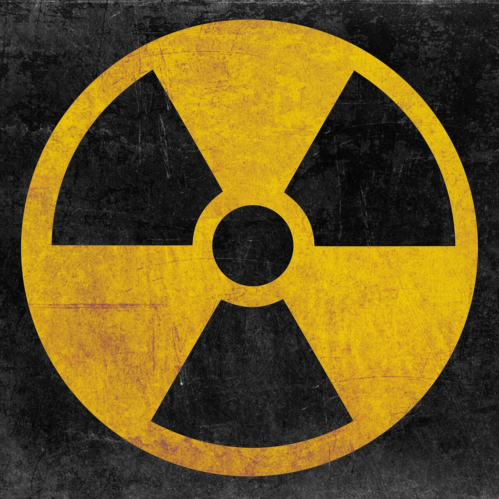
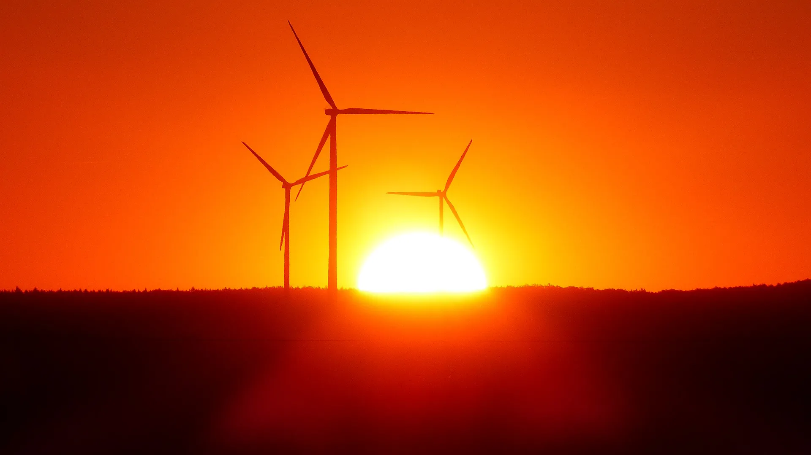
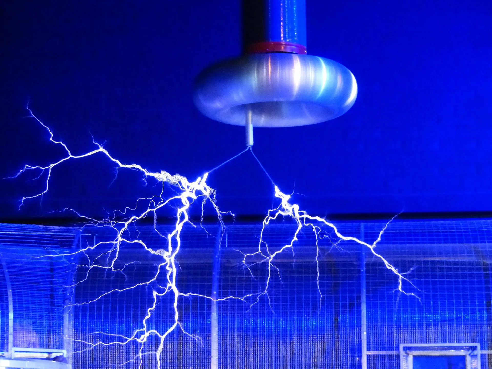

---
hide:
  - toc
---

# 📘 3.º ESO

-   [{ width="100%" }](actividad-cientifica/index.md)

    **La actividad científica**

    Método científico. Medidas de magnitudes. Laboratorio escolar

    [🧑‍🏫 Diapositivas](actividad-cientifica/diapositivas){ .md-tag } [📜 Póster](actividad-cientifica/actividad-cientifica-poster.pdf){ .md-tag }

-   [{ width="100%" }](materia/index.md)

    **La materia**

    Propiedades, estados de agregación y mezclas

    [🧑‍🏫 Diapositivas](materia/diapositivas){ .md-tag } [📜 Póster](materia/materia-poster.pdf){ .md-tag }

-   [{ width="100%" }](leyes-gases/index.md)

    **Leyes de los gases**

    Ley de Boyle-Mariotte, ley de Charles y ley de Gay-Lussac

    [🧑‍🏫 Diapositivas](leyes-gases/diapositivas) · [📜 Póster](leyes-gases/leyes-gases-poster.pdf)

-   [{ width="100%" }](estructura-atomica/index.md)

    **Estructura atómica**

    Teoría atómica de Dalton, modelos atómicos, iones e isótopos

    [🧑‍🏫 Diapositivas](estructura-atomica/diapositivas) · [📜 Póster](estructura-atomica/estructura-atomica-poster.pdf)

-   [{ width="100%" }](radiactividad/index.md)

    **Radiactividad**

    Breve historia, tipos de desintegraciones y reacciones nucleares

    [🧑‍🏫 Diapositivas](radiactividad/diapositivas) · [📜 Póster](radiactividad/radiactividad-poster.pdf)

-   [{ width="100%" }](elementos-compuestos/index.md)

    **Elementos y compuestos**

    Tabla periódica de los elementos. Uniones entre átomos. Elementos y compuestos de especial interés

    [🧑‍🏫 Diapositivas](elementos-compuestos/diapositivas) · [📜 Póster](elementos-compuestos/elementos-compuestos-poster.pdf)

-   [{ width="100%" }](reacciones-quimicas/index.md)

    **Reacciones químicas**

    Cambios físicos y químicos. La reacción química. Iniciación a la estequiometría. Ley de conservación de la masa. Velocidad de reacción. La Química en la sociedad y el medio ambiente

    [🧑‍🏫 Diapositivas](reacciones-quimicas/diapositivas) · [📜 Póster](reacciones-quimicas/reacciones-quimicas-poster.pdf)

-   [{ width="100%" }](energia/index.md)

    **Energía**

    Concepto de energía. Transformaciones energéticas. Calor y temperatura. Fuentes de energía

    [🧑‍🏫 Diapositivas](energia/diapositivas) · [📜 Póster](energia/energia-poster.pdf)

-   [{ width="100%" }](electricidad-electronica/index.md)

    **Electricidad y electrónica**

    Electricidad y circuitos eléctricos. Ley de Ohm. Dispositivos electrónicos. Aspectos industriales de la energía

    [🧑‍🏫 Diapositivas](electricidad-electronica/diapositivas) · [📜 Póster](electricidad-electronica/electricidad-electronica-poster.pdf)

