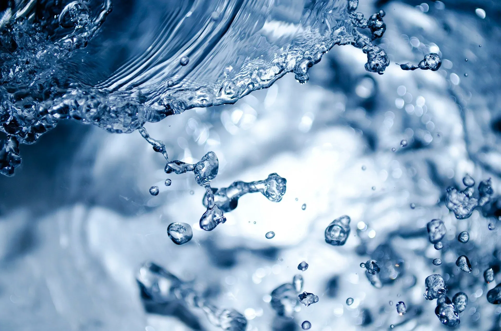

---
hide:
  - toc
---

# 📙 4.º ESO

-   [{ width="100%" }](actividad-cientifica/index.md)

    **La actividad científica**

    La investigación científica. Magnitudes escalares y vectoriales. Análisis dimensional. Errores en la medida. Expresión de resultados

    [🧑‍🏫 Diapositivas](actividad-cientifica/diapositivas) · [📜 Póster](actividad-cientifica/actividad-cientifica-poster.pdf)

-   [{ width="100%" }](modelos-atomicos/index.md)

    **Modelos atómicos**

    Modelos de Thomson, Rutherford y Bohr.

    [🧑‍🏫 Diapositivas](modelos-atomicos/diapositivas) · [📜 Póster](modelos-atomicos/modelos-atomicos-poster.pdf)

-   [{ width="100%" }](sistema-periodico/index.md)

    **Sistema periódico**

    Sistema periódico y configuración electrónica.

    [🧑‍🏫 Diapositivas](sistema-periodico/diapositivas) · [📜 Póster](sistema-periodico/sistema-periodico-poster.pdf)

-   [{ width="100%" }](enlace-quimico/index.md)

    **Enlace químico**

    Enlace iónico, covalente y metálico. Fuerzas intermoleculares

    [🧑‍🏫 Diapositivas](enlace-quimico/diapositivas) · [📜 Póster](enlace-quimico/enlace-quimico-poster.pdf)

-   [{ width="100%" }](reacciones-quimicas/index.md)

    **Reacciones químicas**

    Ajuste de ecuaciones químicas, cálculos masa-masa y cálculos masa-volumen

    [🧑‍🏫 Diapositivas](reacciones-quimicas/diapositivas) · [📜 Póster](reacciones-quimicas/reacciones-quimicas-poster.pdf)

-   [{ width="100%" }](movimientos/index.md)

    **Movimientos**

    MRU, MRUA y MCU

    [🧑‍🏫 Diapositivas](movimientos/diapositivas) · [📜 Póster](movimientos/movimientos-poster.pdf)

-   [{ width="100%" }](fuerzas/index.md)

    **Fuerzas**

    Leyes de Newton y fuerzas de especial interés

    [🧑‍🏫 Diapositivas](fuerzas/diapositivas) · [📜 Póster](fuerzas/fuerzas-poster.pdf)

-   [{ width="100%" }](fluidos/index.md)

    **Fluidos**

    Concepto de presión, principios de la hidrostática y física de la atmósfera

    [🧑‍🏫 Diapositivas](fluidos/diapositivas) · [📜 Póster](fluidos/fluidos-poster.pdf)

-   [{ width="100%" }](energia-trabajo-calor/index.md)

    **Energía, trabajo y calor**

    Energía y sus formas de intercambio (trabajo y calor)

    [🧑‍🏫 Diapositivas](energia-trabajo-calor/diapositivas) · [📜 Póster](energia-trabajo-calor/energia-trabajo-calor-poster.pdf)

