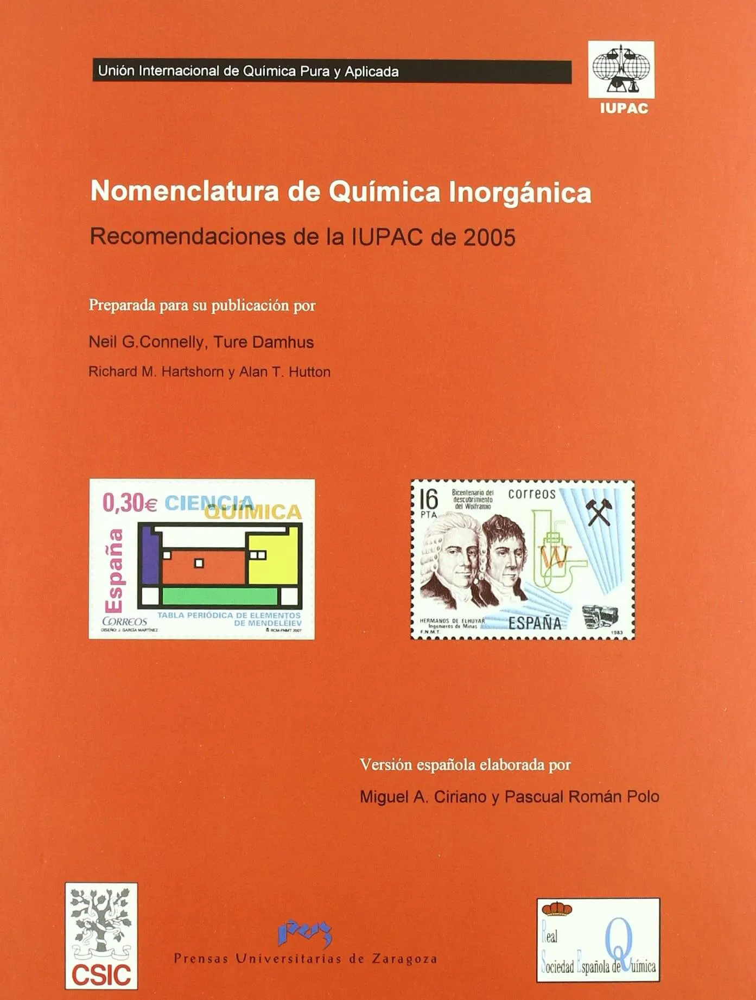
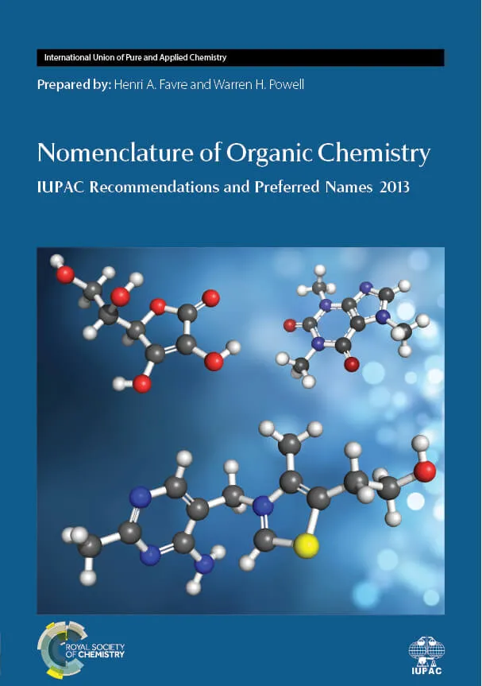

---
hide:
  - toc
---

# 📔 Formulación y nomenclatura de Química

!!! note ""
    También te recomendamos echar un vistazo a los **apuntes** de [**FiQuiPedia**](http://www.fiquipedia.es/home/recursos/recursos-apuntes/recursos-apuntes-formulacion#TOC-Apuntes-elaboraci-n-propia), a los de [**FisQuiWeb**](https://fisquiweb.es/Formulacion/index.htm), a los de [**Nomenclatura química**](https://www.nomenclaturaquimica.com) o a las **cienciografías** de **Samuel Escudero** ([**inorgánica**](https://lasbarbasdedarwin.files.wordpress.com/2021/11/plbdd_formulacion_inorganica_.pdf) y [**orgánica**](https://lasbarbasdedarwin.files.wordpress.com/2021/11/plbdd_formulacion_organica.pdf)).

    En [este **solucionario**](https://web-argitalpena.adm.ehu.es/bxnn/UCPDF22EBAZ.pdf) puedes encontrar muchos **ejemplos** para habituarte con la **nomenclatura química**.

-   [{ width="100%" }](inorganica/index.md)

    **Inorgánica**

    Recomendaciones de la IUPAC de 2005

-   [{ width="100%" }](organica/index.md)

    **Orgánica**

    Recomendaciones y nombres preferidos de la IUPAC de 2013

